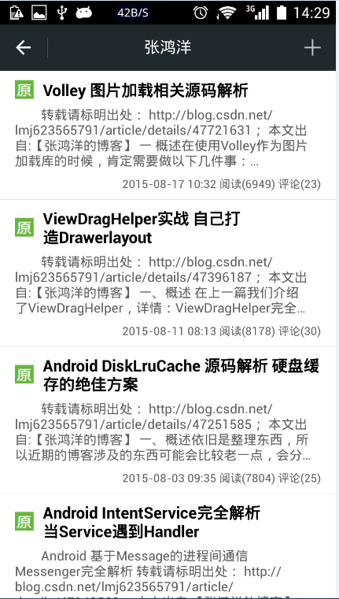
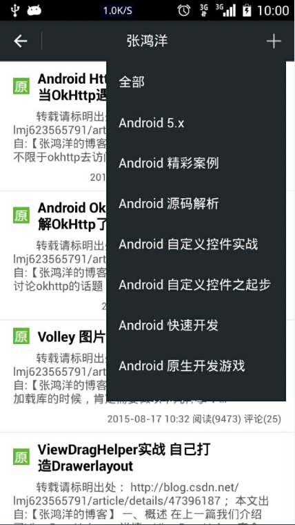
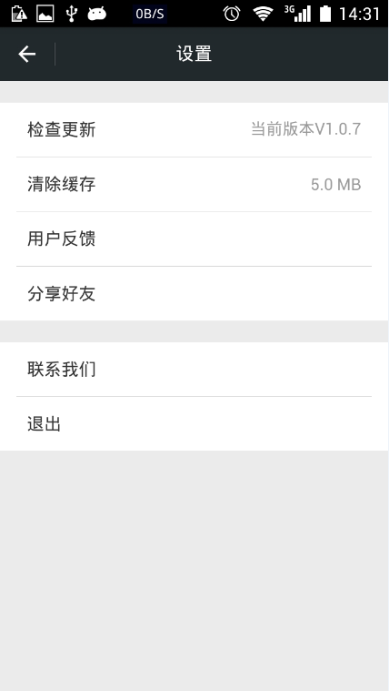

# 关于软件
这是一款可以随时查看CSDN博客的开源软件，欢迎Star或Fork。
目前默认支持Android分类的博客，内置了五十余名Android博客专家。

最新版本2.0.0
- [点我下载](http://www.pgyer.com/csdn)
- [更新历史](./app/Notes.md)

## 功能列表
- 查看博客专家列表【默认添加50名CSDN博客专家】
- 自定义添加、删除博主，置顶博主
- 查看博客列表，博客分类，以及博客详情，博客评论
- 支持收藏博客
- 支持离线阅读，包括博主、博客列表、博客详情，博客评论
- 支持最新、最新的博客，技术点，以及博客专栏
- 支持分享功能
- 支持软件自动更新，升级

## 免责声明
本应用所收集的部分公开资料来源于CSDN网站[http://www.csdn.net/](http://www.csdn.net/)。
转载的目的在于传递更多信息及用于网络分享，并不代表本站赞同其观点和对其真实性负责，也不构成任何其他建议。
如果您发现本应用有侵犯您的知识产权的作品，请与我们取得联系，我们会及时修改或删除。

## 应用截图

	
